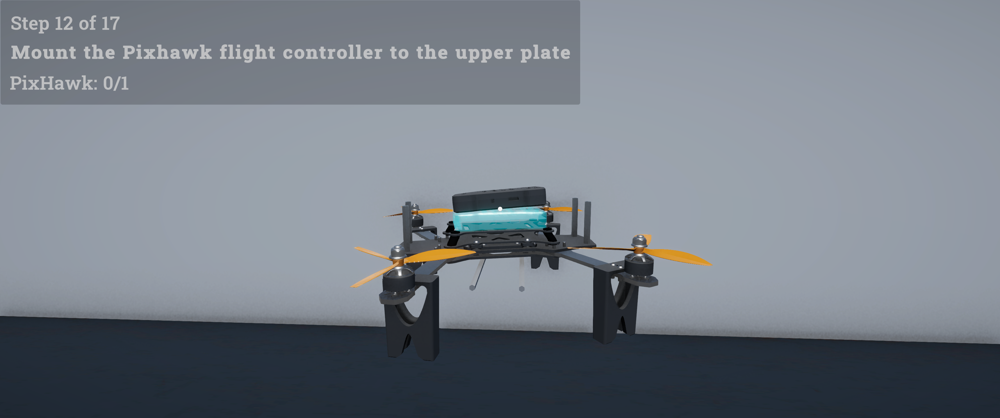
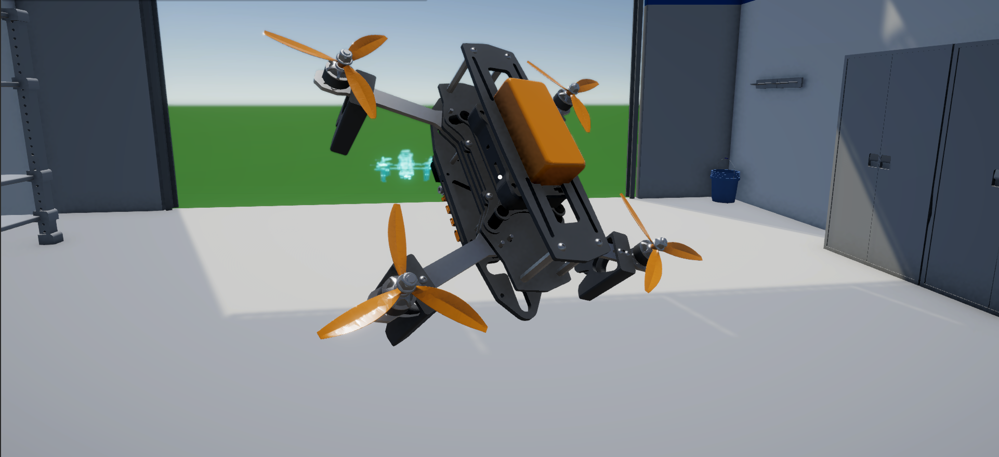

*Read this in other languages: [English](README.md), [Čeština](README.cs.md).*

[](https://chroustek.itch.io/drone-assembly-simulator)
[](https://chroustek.itch.io/droneassembly-vr)
[](https://unity.com/)
[](https://azure.microsoft.com/)
[](https://dotnet.microsoft.com/)
[](LICENSE)

# Drone Assembly Simulator

**Drone Assembly Simulator** is a 3D interactive simulation built in Unity (Playable on PC and VR), where the player assembles a drone by snapping individual parts together in the correct order. Upon completing the assembly, the player's time is submitted to a **global online leaderboard** — backed by a robust cloud infrastructure deployed on Microsoft Azure.

This project was created as a portfolio piece, showcasing a complete **3-tier cloud architecture**: a Unity game client, a modern **.NET 8 Minimal API**, and a cloud-hosted MySQL database — all provisioned via Infrastructure as Code (Terraform).

> 🔗 **Backend Repository:** The source code for the C# .NET API is maintained in a separate repository to ensure strict separation of concerns. You can view the backend architecture [**here**](https://github.com/Skroxos/Drone-Assembly-Simulator-Api).


[](https://youtu.be/AfFFgCSjMrA)
<p align="center">
  
</p>

<p align="center">
  
  &nbsp;
  
</p>


## Architecture & Tech Stack

```
[ Unity Client (C#) ]
        │
        │  HTTPS + SHA-256 signed payload
        ▼
[ .NET 8 Minimal API — Azure App Service ]
        │
        │  Entity Framework Core (Code-First)
        ▼
[ MySQL Flexible Server — Azure ]
```

| Layer | Technology |
|---|---|
| Game Client | Unity 2022+, C# |
| REST API | .NET 8, Minimal API, C# |
| ORM / Database | Entity Framework Core, Azure MySQL Flexible Server 8.0 |
| Infrastructure | Terraform, Azure App Service (Linux) |
| Security | SHA-256 payload signing, ASP.NET Core Native Rate Limiting |

### API Endpoints

| Endpoint | Method | Description |
|---|---|---|
| `/api/assembly/save` | `POST` | Validates hash signature and saves a new assembly session |
| `/api/assembly/top10` | `GET` | Fetches the top 10 fastest completion times |

---

## Performance & Optimization (Standalone VR)

For enterprise-grade XR applications, maintaining stable framerates and strict memory management is critical. The standalone VR build was rigorously profiled directly on the headset using the OVR Metrics Tool to ensure zero performance bottlenecks during heavy instantiation and manipulation of 3D assets.

## Telemetry Insights
* **Stable 72 FPS:** The application maintains a rock-solid framerate throughout the entire assembly process, ensuring visual comfort. CPU and GPU utilization remains highly optimized (averaging under 50%).
* **Memory Management:** The App PSS (Proportional Set Size) curve remains completely flat during the core gameplay loop. This proves that the architecture efficiently prevents memory leaks and costly GC spikes.
---

## Other Technical Highlights
* **Automated CI Pipeline:** Configured GitHub Actions for headless Unity builds, secure secret management, and automated unit testing on every push/PR to ensure production stability.
* **Code-First Database Migration:** The backend database schema is fully managed via Entity Framework Core migrations, ensuring seamless synchronization between C# models and the Azure MySQL database.
* **Data-Driven Architecture:** Extensive use of Scriptable Objects (Procedure SO) to allow rapid iteration of assembly logic without touching the codebase.
* **Custom Editor Tools:** To help with level design and logic testing.
* **Asynchronous Networking:** Utilizing modern C# async/await and UniTask for all API calls to ensure smooth UI thread performance without callback hell.

## Credits
* **3D Drone Model:** Created by *Angel* on GrabCAD.
* **Background Music:** Created by *Kuzu* (Pixabay).
* **Sound Effects:** Created by *DRAGON-STUDIO* and *Klemen Flerin* (Pixabay).
