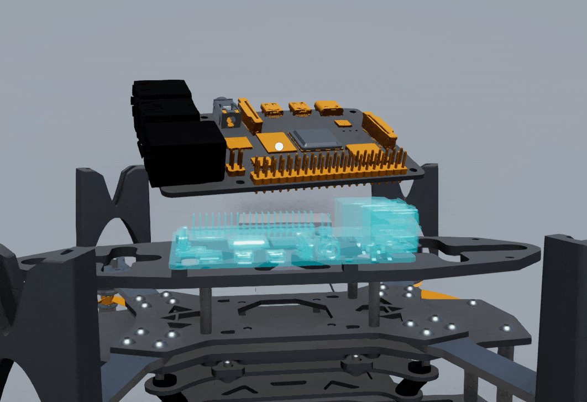

*Read this in other languages: [English](README.md), [Čeština](README.cs.md).*

**Drone Assembly Simulator** is a 3D simulator created in Unity where players can build their own drone. The project features a fully functional cloud backend with a global online leaderboard.

  

## Features
* **Interactive Drone** Assembly with precise part positioning
* **Global Online Leaderboard** After completing the drone assembly, players submit their times and compete with others.

## Architecture & Tech Stack
**Game Engine:** Unity (C#)
* **Database:** Microsoft Azure SQL Database (Cloud-hosted).
* **Web API:** Custom Azure App Service acting as a bridge between Unity and the database.
* **Security:** Scores sent from Unity are secured using a SHA256 hash with a secret key.

## Credits
* **3D Drone Model:** Created by *Angel* on GrabCAD.
* **Background Music:** Created by *Kuzu* (Pixabay).
* **Sound Effects:** Created by *DRAGON-STUDIO* and *Klemen Flerin* (Pixabay).
